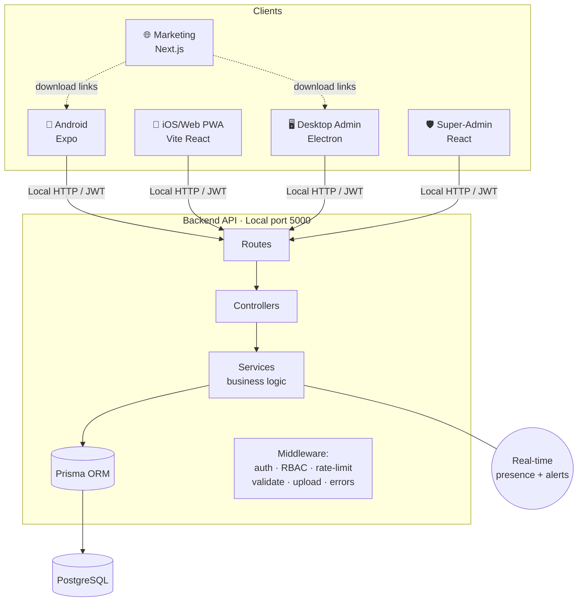
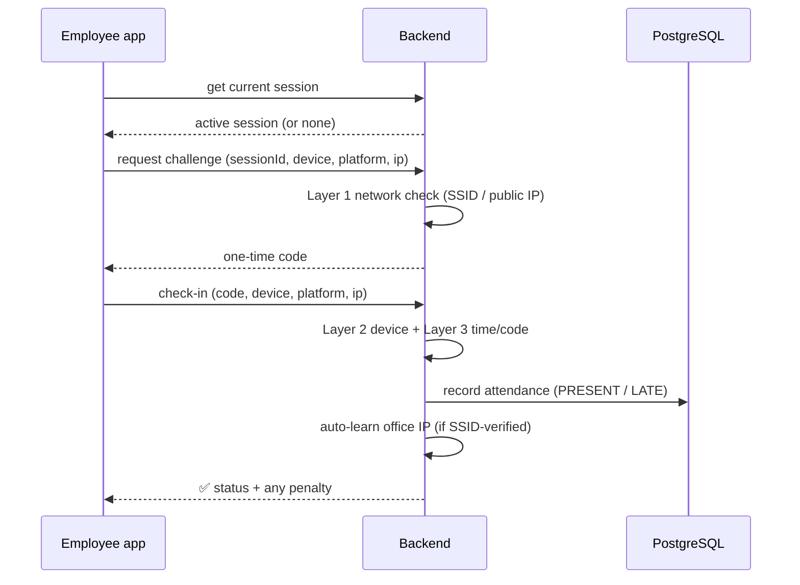

# Architecture

## Big picture

## Layered backend (clean separation)
Each request flows through clear layers — **thin controllers, fat services**:

`Route → Middleware → Controller → Service → Prisma → PostgreSQL`

- **Routes** (`routes/*.js`) — URL → handler mapping only.
- **Middleware** (`middleware/*.js`) — cross-cutting: `auth` (JWT), `roleGuard` (RBAC), `rateLimiter`, `validate`, `upload`, `errorHandler`.
- **Controllers** (`controllers/*.js`) — parse request, call a service, shape response. No business logic.
- **Services** (`services/*.js`) — all the real logic, e.g. `AttendanceService`, `AuthenticationService`, `FraudDetectionEngine`, `SessionService`, `BreakService`, `LeaveService`, `ReportService`, `NotificationService`, `EmergencyControlService`, `QRTokenService`.
- **Prisma** — single typed data layer + migrations over PostgreSQL.

## Check-in sequence (the core flow)

## Multi-tenancy
One backend serves all organizations. Isolation is enforced in the data layer — **every query is scoped by `orgId`** (Super Admin excepted). → [[How It's Clean]] · [[User Roles]]

Related: [[Tech Stack]] · [[Data Model]] · [[Deployment & Live URLs]]
